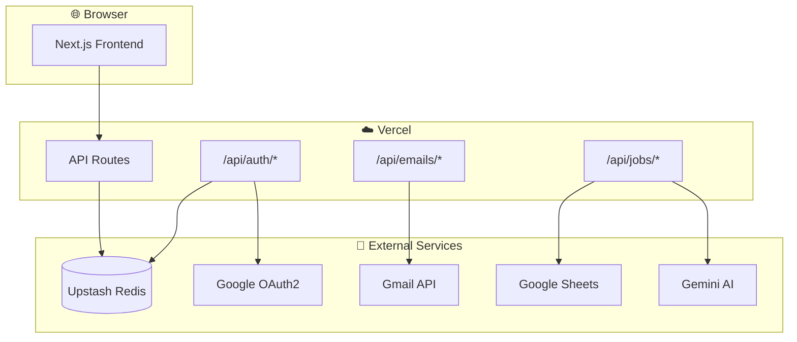
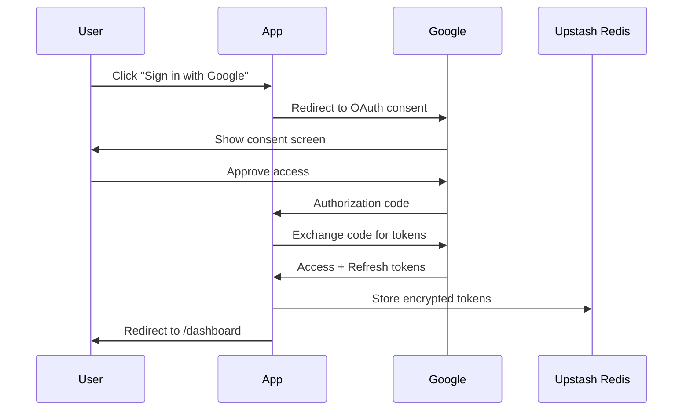

# Gmail Assistant

> AI-powered job application tracker that automatically detects and organizes job-related emails from your Gmail.

**🔗 Production URL**: [gmail-assistant.vercel.app](https://gmail-assistant.vercel.app)

---

## ✨ Features

| Feature                   | Description                                                       |
| ------------------------- | ----------------------------------------------------------------- |
| 🔐 **Google OAuth2**      | Secure read-only Gmail access                                     |
| 🤖 **AI Classification**  | Gemini 2.5 Flash detects job applications, rejections, interviews |
| 📊 **Google Sheets Sync** | Auto-export tracked jobs to your spreadsheet                      |
| ⚡ **Serverless**         | Deployed on Vercel with Upstash Redis                             |
| 🎨 **Modern UI**          | Dark theme with Tailwind CSS                                      |

---

## 🏗️ Architecture

### Production Flow



### OAuth2 Flow



---

## 📁 Project Structure

```
gmail-assistant/
├── app/
│   ├── page.tsx                 # Landing page
│   ├── dashboard/page.tsx       # Main dashboard
│   └── api/
│       ├── auth/                # OAuth: login, callback, logout, status
│       ├── emails/              # index, search, stats
│       └── jobs/track           # AI job classification
├── lib/
│   ├── gmail.ts                 # Gmail API client
│   ├── gemini.ts                # Gemini AI client
│   ├── jobClassifier.ts         # AI prompt for job detection
│   ├── kv.ts                    # Upstash Redis token storage
│   ├── session.ts               # Cookie session management
│   ├── sheets.ts                # Google Sheets integration
│   └── types.ts                 # TypeScript interfaces
└── components/ui/               # Shadcn/Tailwind components
```

---

## 🚀 Quick Start

### Prerequisites

- Node.js 18+
- Google Cloud project with OAuth2 credentials
- Upstash Redis database
- (Optional) Gemini API key for AI features

### Local Development

```bash
# 1. Clone and install
cd gmail-assistant
npm install

# 2. Configure environment
cp .env.local.example .env.local
# Edit .env.local with your credentials

# 3. Run dev server
npm run dev
# Open http://localhost:3000
```

### Environment Variables

| Variable                   | Description           | Required |
| -------------------------- | --------------------- | -------- |
| `GOOGLE_CLIENT_ID`         | OAuth client ID       | ✅       |
| `GOOGLE_CLIENT_SECRET`     | OAuth client secret   | ✅       |
| `GOOGLE_REDIRECT_URI`      | Callback URL          | ✅       |
| `UPSTASH_REDIS_REST_URL`   | Redis REST endpoint   | ✅       |
| `UPSTASH_REDIS_REST_TOKEN` | Redis auth token      | ✅       |
| `GEMINI_API_KEY`           | Gemini AI key         | ✅       |
| `GOOGLE_SHEET_ID`          | Target spreadsheet ID | Optional |

**Local redirect URI**: `http://localhost:3000/api/auth/callback`  
**Production redirect URI**: `https://gmail-assistant.vercel.app/api/auth/callback`

---

## 🔧 Google Cloud Setup

1. **Create project** at [console.cloud.google.com](https://console.cloud.google.com)
2. **Enable APIs**: Gmail API, Google Sheets API
3. **OAuth consent screen**: External, add test users
4. **Create credentials**: OAuth 2.0 Client ID (Web application)
5. **Add redirect URIs** (both local and production)

---

## 🛠️ Tech Stack

| Layer      | Technology              |
| ---------- | ----------------------- |
| Framework  | Next.js 16 (App Router) |
| Language   | TypeScript              |
| Styling    | Tailwind CSS            |
| Auth       | Google OAuth2           |
| AI         | Gemini 2.5 Flash        |
| Cache      | Upstash Redis           |
| Deployment | Vercel Serverless       |

---

## 🔒 Security

- **Read-only Gmail access** (`gmail.readonly` scope)
- **Encrypted token storage** in Upstash Redis
- **httpOnly session cookies**
- **No email content stored** — only metadata for classification

---

## 📝 License

MIT — Built for personal job tracking use.

---

**Last Updated**: January 2, 2026
